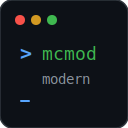

# mcmods-modern

> MCMod (MC百科) 网站美化 Firefox 扩展 · Claude Code 硬核编码科技风格

<p align="center">
  
</p>

<p align="center">
  <strong>将 MCMod 整站外观重绘为终端/CLI 风格的暗色编码界面</strong>
</p>

<p align="center">
  <sub>🤖 本项目由 <strong>DeepSeek-V4</strong> AI 辅助开发 · <em>AI-native project</em></sub>
</p>

---

## 效果预览


- 🌑 **终端黑底色** `#1a1b26` · 高对比度正文 `#c9d1d9`
- 🔵 **电光蓝** 链接/主操作 · 🟣 **冷紫** 高亮 · 🟢 **终端绿** 强调
- ⌨️ 等宽字体 (`JetBrains Mono`) 用于代码/导航/数据
- 🪟 卡片/弹窗伪终端窗口风格 (`● ● ●` 标题栏装饰)
- 📜 暗色细窄滚动条
- 💬 右下角 `> mcmod.modern loaded` CLI 装饰

## 安装

### 开发版（临时加载）

```bash
# 1. 构建
npm run build:firefox

# 2. Firefox 地址栏 → about:debugging → 此 Firefox → 临时载入附加组件
# 3. 选择 dist\firefox-mv2\manifest.json
```

### 开发模式（热更新）

```bash
npm run dev:firefox
```

### 正式安装

将 `dist/firefox-mv2/` 打包为 `.zip`，提交至 [Firefox Add-ons (AMO)](https://addons.mozilla.org/) 审核后公开发布。

## 技术栈

| 层面 | 技术 |
|------|------|
| 扩展框架 | [WXT](https://wxt.dev/) (Web eXtension Tools) |
| 语言 | TypeScript + CSS |
| 构建 | Vite (WXT 内置) |
| 样式架构 | CSS Custom Properties (`--mcmods-*` 命名空间) |
| 目标平台 | Firefox Manifest V3 |
| 目标站点 | `https://www.mcmod.cn/` |
| 包管理 | npm |
| AI 开发 | [DeepSeek-V4](https://deepseek.com/) |

## 目录结构

```
mcmods-modern/
├── src/
│   ├── entrypoints/        # WXT 入口
│   │   ├── content.ts      # Content Script (样式注入 + CLI 装饰)
│   │   └── background.ts   # Service Worker (设置存储)
│   ├── styles/
│   │   ├── base/           # 基础层
│   │   │   ├── variables.css   # 设计 Token
│   │   │   ├── reset.css       # 全局重置
│   │   │   └── scrollbar.css   # 终端滚动条
│   │   ├── components/     # 组件层
│   │   │   ├── navbar.css      # 导航栏
│   │   │   ├── cards.css       # 卡片/面板
│   │   │   ├── buttons.css     # 按钮
│   │   │   ├── tables.css      # 表格
│   │   │   ├── modals.css      # 弹窗
│   │   │   └── search.css      # 搜索框
│   │   └── pages/          # 页面层
│   │       ├── home.css        # 首页
│   │       ├── item.css        # 详情页
│   │       └── list.css        # 列表页
│   └── utils/
│       └── observer.ts     # MutationObserver 封装
├── public/icons/
│   └── icon.svg            # 终端风格扩展图标
├── wxt.config.ts
├── package.json
├── tsconfig.json
└── README.md
```

## 命令

```bash
npm run dev              # 开发模式（Chrome 默认）
npm run dev:firefox      # 开发模式（Firefox）
npm run build            # 生产构建（Chrome）
npm run build:firefox    # 生产构建（Firefox）
npm run zip:firefox      # 打包 .zip（提交 AMO）
npm run lint             # ESLint 检查
npm run typecheck        # TypeScript 类型检查
```

## 设计规范

完整设计语言参见 [AGENTS.md](./AGENTS.md)，核心要点：

- **克制** — 纯 CSS 覆盖为主，不改动 DOM 结构
- **可读性** — 正文对比度 ≥ 4.5:1 (WCAG AA)
- **性能** — 零运行时框架，无第三方依赖
- **命名空间** — CSS 类名前缀 `mcmods-`，DOM id 前缀 `__mcmods-`

## 开发

```bash
git clone <repo>
cd mcmods-modern
npm install
npm run dev:firefox
```

新站点适配流程：
1. 在目标站点分析页面 DOM，确定选择器
2. 在 `src/styles/` 对应层级编写 CSS 覆盖
3. 在 `content.ts` 中 `import` 新样式
4. 构建 → Firefox 加载 → 验证

## 许可

MIT

---

<p align="center">
  <sub>Built with 🤖 <strong>DeepSeek-V4</strong> AI · 2026</sub>
</p>
